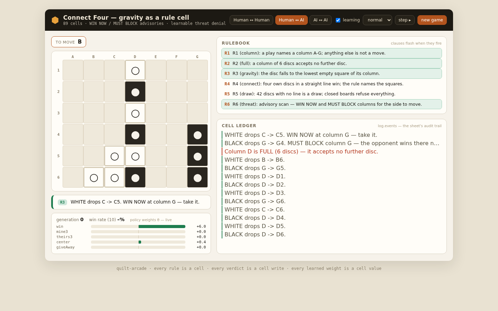
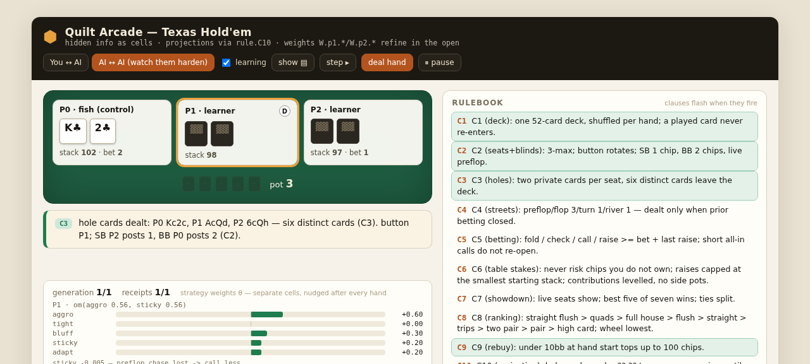
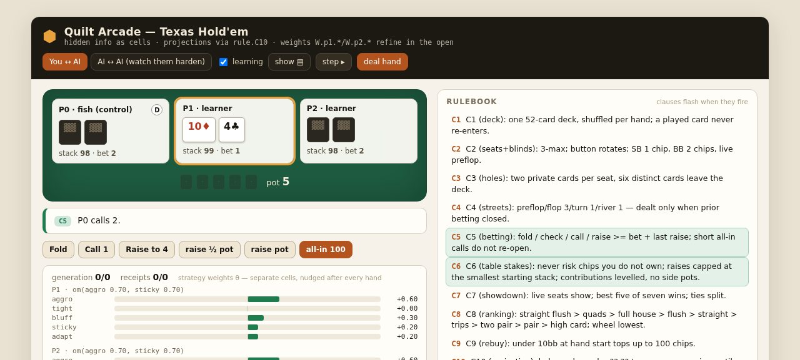
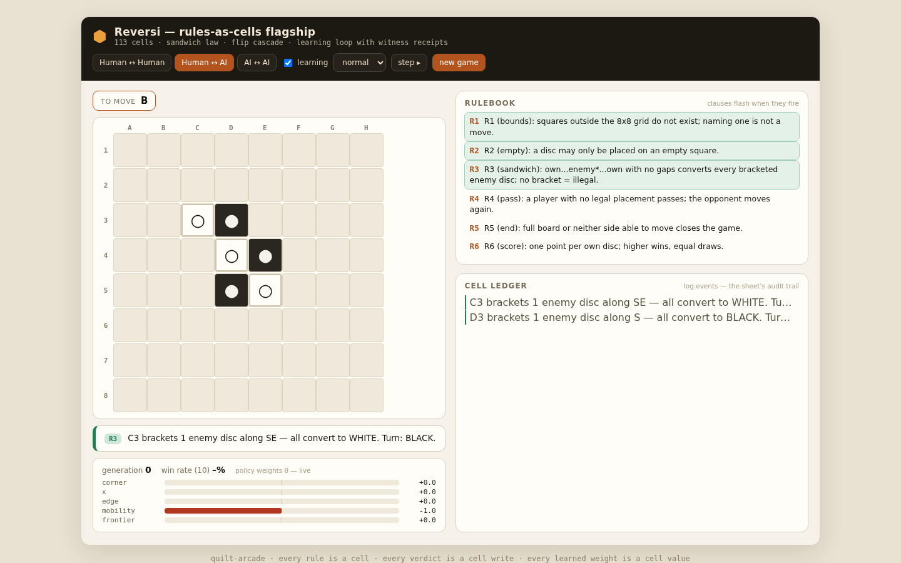

# quilt-arcade

**Browser games on the Quilt reactive-cell engine, where every meaningful event leaves a cryptographic receipt.**
Six games, no framework, no build step. Every rule is a cell, every verdict is a cell write, every learned weight is a cell value — and each meaningful event is hashed into an fnv1a-64 chain from GENESIS, so a game's history is a set of claims you can challenge, not a story you have to trust. Every component (engine core, game module, receipt renderer, judge/jester/quantum/predictor slots) is independently replaceable without touching the others.

New here? Play below, then read the constitution — the constitution is the law of this repo, but orientation comes first.

## Play in 30 seconds

```bash
git clone https://github.com/SuperInstance/quilt-arcade.git
cd quilt-arcade
```

No install needed to play — each game is a single self-contained HTML file. Open one in a browser:

- **`games/tictactoe/index.html`** — the template game. You get a board vs an AI, with the live receipt panel alongside: every move, verdict, and learned weight rendered as a human-readable line under a chain-verification badge.

Every `games/<g>/index.html` works the same way — table or board on one side, receipts on the other. No bundler, no dev server, no network.

Headless smoke + full playtests (Node 18+; `npm ci` once for the single `yaml` dependency):

```bash
npm ci
node run_all.mjs
```

Expected tail (run and verified on `main`, 2026-09-28):

```
SCOREBOARD
────────────────────────────────────────────────────
✓ [smoke] connect4       plugin green
✓ [smoke] gomoku         plugin green
✓ [smoke] holdem         plugin green
✓ [smoke] pong           plugin green
✓ [smoke] reversi        plugin green
✓ [smoke] tictactoe      plugin green
✓ [play] tictactoe       11/11 green  (6527ms)
✓ [play] reversi         12/12 green  (34744ms)
✓ [play] connect4        11/11 green  (31149ms)
✓ [play] gomoku          9/9 green    (35605ms)
✓ [play] holdem          12/12 green  (11514ms)
✓ [play] pong            12/12 green  (12212ms)
────────────────────────────────────────────────────
ALL GREEN — 6 plugins smoke-clean, 67 checks across 6 games
```

Phase A (plugin gate) loads every plugin under a stub DOM, validates `manifest.json` ≡ the built sheet, boots it, runs its own `smoke()` interaction, and asserts ≥1 receipt with hash chains re-derived from GENESIS. Phase B (behavior gate) runs each game's full playtest harness — 67 checks total, timings are machine-dependent.

## The six games

| game | `games/<g>/` | one-liner (from each manifest) |
|------|--------------|--------------------------------|
| TicTacToe    | `tictactoe/` | the template game — start here |
| Reversi      | `reversi/`   | rules-as-cells flagship |
| Connect Four | `connect4/`  | gravity as a rule cell |
| Gomoku       | `gomoku/`    | pattern law + learning loop |
| Texas Hold'em| `holdem/`    | hidden information; GAN-hardened 5-card evaluator (840/840 probe equivalence) |
| Pong         | `pong/`      | realtime laws on the discrete sheet |

## Why receipts

Every experiment leaves a receipt (`shared/receipts.mjs`): human-readable lines, with chained sources carrying an fnv1a-64 hash chain from GENESIS and a chain-verification badge in the panel — a broken chain renders `✗ BROKEN`, not silence. Failures are documented in `NEGATIVE_SPACE.md` with the same honesty. A game event is a claim you can re-derive and challenge. The idiom is fleet-wide: MicroMoth-quilt uses the same hash for cell ids, tidepool for rate-limit fingerprints, quilt-tools for its referral graph — one receipt discipline, many ships.

## The plugin surface

Each game is two files — the whole linkable surface:

| file | role |
|------|------|
| `games/<g>/manifest.json` | declarations: cells, listeners, receipts surface (sources + fnv1a64 fields), deps, slots |
| `games/<g>/module.mjs`    | behavior: `id`, `buildSheet()`, `createDriver(engine)`, `smoke(engine)`, `slots`, `receipts` |

- **No cross-imports between game modules.** Games talk to the engine core (`engine/`) and the shared platform (`shared/`: kit, driver, viewer, receipts) only. Swap any block — engine core, a game module, the receipt-renderer, a slot — without touching the others.
- **Slots** (`slots/`): judge (JEV), jester, quantum (MOTH/MicroMoth), predictor (JEPA) — interfaces now, implementations later. Credentials, when needed, come from env vars (`QUILT_SLOT_*_KEY`); none are configured yet, and every game must stay fully playable with all slots returning null.
- **Headless smoke**: `node run_all.mjs` (above). This gate existed before the games were pluginized and failed on every game until each plugin landed — pins first, code second.
- **Embedding**: `games/<g>/index.html` is the zero-build iframe surface (single-file bundle). Pong is plugin #6 and doesn't have its `index.html` yet — headless only for now.

## QA receipts

Field captures from the playtest harnesses (`experiments/qa_*.png`):


*Connect Four — gravity as a rule cell, receipts chained from GENESIS.*


*Hold'em — hidden information; two AIs battle under the arbiter cells.*


*Hold'em — the human seat: same engine, same receipt discipline.*


*Reversi — the flagship: every rule a cell, every verdict a cell write.*

## Reading beyond

- **SuperInstance/quilt** — the engine. "A spreadsheet where every cell is a live, addressable capability. The grid is the runtime."
- **SuperInstance/coev** — adversarial coevolution engine with champion-integrity auditing (zero-dep Node, extracted from pong-quilt C1): the judge slot's future bloodline.
- `NEGATIVE_SPACE.md` — failures, documented. `PATTERNS.md` — what's been learned. `docs/Z_PATCH_RECONCILE.md` — worklog lineage.

## Constitution (Casey, 2026-09-25)

- Every game is a **plugin**: a self-contained module exposing a manifest (cells, listeners, receipts surface).
- Components rearrange: engine core, game modules, receipt-renderer, judge/jester/quantum plugin slots — each independently replaceable.
- Linkable: any module must run embedded (iframe) with a two-file surface (module + manifest).
- Every experiment leaves a receipt; failures documented in NEGATIVE_SPACE.md.
- No framework, no build step required to play.

Origin: Super Z portfolio drop 2026-09-25 (z.ai lane). Imported by kimi1; attribution in worklog lineage.
